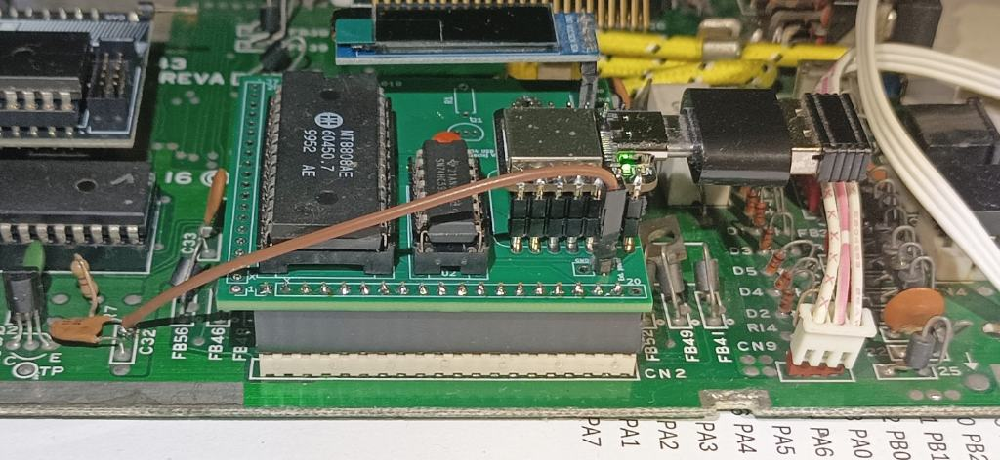
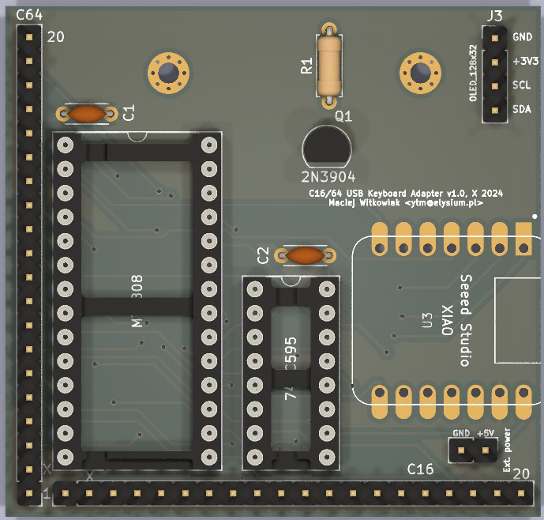
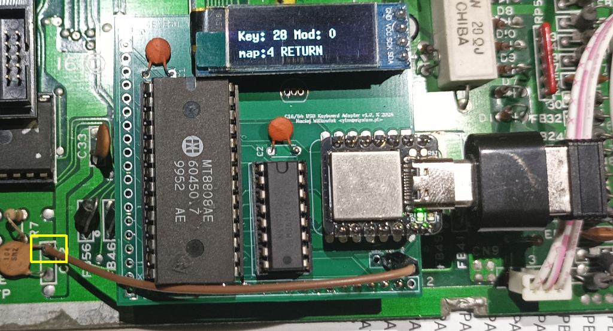

# C16 USB Keyboard

This project is designed to allow a modern USB keyboard to be used with a Commodore C16 or Commodore C64 instead of the original Commodore keyboard.

It is intended to be plugged into the internal 20-pin keyboard connector.

This was forked from [C128 USB Keyboard project](https://github.com/ytmytm/C128-keyboard), initially forked from https://github.com/Hartland/C64-Keyboard but I made lots of both hardware and software modifications
to achieve my goal of supporting full C128 keyboard.

I have kept only USB section as PS/2 keyboards are becoming retro themselves.

This project requires SEEED XIAO SAMD21, which has USB-C socket. USB-C keyboards are rare yet. I use OTG USB-A (female) to USB-C (male) adapter to connect standard PC keyboard.

-- Maciej 'YTM/Elysium' Witkowiak

<!---  -->

# Features

- can be used with any USB keyboard, including wireless ones
- keyboard maps switchable on the fly
- OLED display support
- adapter can be plugged directly into keyboard port

# PCB and schematic

Use KiCad to open the project in [kicad-c128keyb](kicad-c128keyb/) folder.

In the [kicad-c128keyb/plots](kicad-c128keyb/plots) you will find ready to use Gerber files for manufacturing
as well as [schematic](kicad-c128keyb/plots/kicad-c128keyb.pdf)

The easiest way to order PCBs is through the shared project page on PCBWAY. Simply [click this link](https://www.pcbway.com/project/shareproject/C128_USB_Keyboard_adapter_dcf19251.html) and add to your cart.

## Parts

* SEEED XIAO SAMD21 (important: SAMD21, not RP2040)
* U1: MT8808
* U2: 74HCT595
* C1, C2: 100n capacitors
* pin headers and sockets
* 128x32 SSD1306 I2C OLED display (optional)

C16 option:

* use J5 as keyboard connector
* J4 to provide power, connect +5V to the square pad
* don't install Q1 and R1

C64 option:

* use J2 as keyboard connector
* Q1: 2N3904 transistors (or any other NPN, like S9013)
* R1: 10K resistors

### C16 option

There is no +5V pin connected to keyboard connector in C16. Connect +5V from anywhere inside computer (e.g. one of the legs of C22 - yellow square on the photo below) to the square pad of J4.

### Restore key (C64 only)

Install Q1 and R1.

# Firmware

## Common

* SEEED XIAO uses slightly modified USBHOST Arduino library [SEEED/C64_USB_Host_Library_SAMD](SEEED/C64_USB_Host_Library_SAMD). This directory will need to be copied into the Arduino library directory.

* SEEED XIAO will need its board driver installed into the Arduino IDE. See manufacturers instructions.

## C16

Use Arduino IDE to compile and flash relevant sketch from [SEEED/C16_keyboard/C16_keyboard.ino](SEEED/C16_keyboard/C16_keyboard.ino).

## C64

Use Arduino IDE to compile and flash relevant sketch from [SEEED/C16_keyboard/C64_keyboard.ino](SEEED/C64_keyboard/C64_keyboard.ino).

C64 firmware is a trimmed-down version of [C128 USB keyboard firmware](https://github.com/ytmytm/C128-keyboard) with special C128 keys and joystick simulation removed (not possible with MT8808).

# Keyboard mapping

Key maps are defined in [SEEED/C16_keyboard/keymaps.h](SEEED/C16_keyboard/keymaps.h) and [SEEED/C64_keyboard/keymaps.h](SEEED/C64_keyboard/keymaps.h).

You can modify existing ones or add your own.

If you add a new keymap you need to add it to `keymaps[]` array at the bottom of that file. The first key map in that array is the default one.

## C16 positional (default for C16)

To be defined...

## C16 symbolic

| USB key | C16 key |
|---------|----------|
| ESC | ESC |
| F1 | F1 |
| F2 | F4 (shift+F1) |
| F3 | F2 |
| F4 | F5 (shift+F2) |
| F5 | F3 |
| F6 | F6 (shift+F3) |
| F7 | HELP |
| F8 | F7 (shift+HELP) |
| ` ~ | (left arrow) |
| \ | POUND |
| Tab | CTRL |
| Caps lock | RUN/STOP |
| Home | CLR/HOME |
| End | RUN/STOP |
| left CTRL | CTRL |
| right CTRL | CTRL |
| left Windows | C= key | 
| Print Screen | reset MT8808 switchboard |
| Scroll Lock | Shift Lock |
| Pause | switch to next keymap |
| (keypad) | digits 1-9,0 |
| (cursors) | cursors |

As you would expect from standard keycaps, e.g. SHIFT+2 is '@', not '"'.

## C64 positional (default for C64)

This layout works best if you have muscle memory of the original keyboard.

| USB key | C64 key |
|---------|----------|
| ESC | RUN/STOP |
| F9 | F1/F2 |
| F10 | F3/F4 |
| F11 | F5/F6 |
| F12 | F7/F8 |
| Print Screen | reset MT8808 switchboard |
| Scroll Lock | Shift Lock |
| Pause | switch to next keymap |
| Insert | POUND |
| Home | CLR/HOME |
| Page Up | RESTORE |
| End | RUN/STOP |
| (keypad) | digits 1-9,0 |
| left CTRL | C= key |
| left SHIFT | left SHIFT |
| right SHIFT | right SHIFT |
| AltGr | RESTORE |

## C64 symbolic

As you would expect from standard keycaps, e.g. SHIFT+2 is '@', not '"'.

Other changes:

- both left and right CTRL mapped to CTRL
- both left and right Windows mapped to C= key
- AltGr is RESTORE
